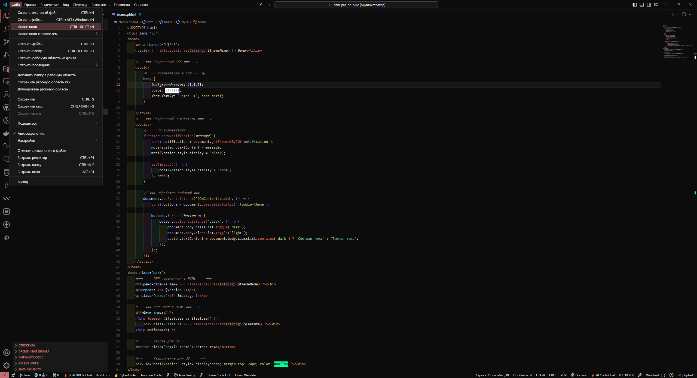
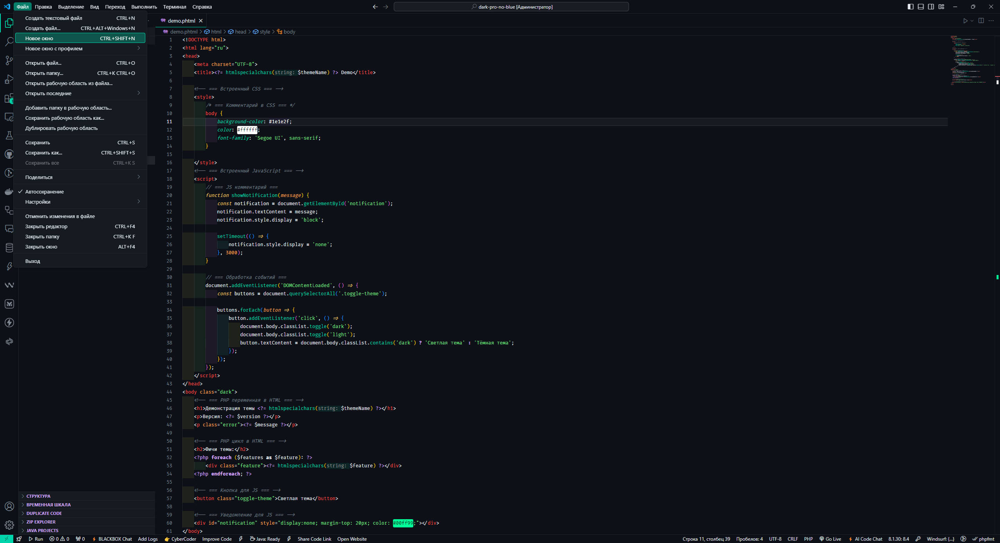
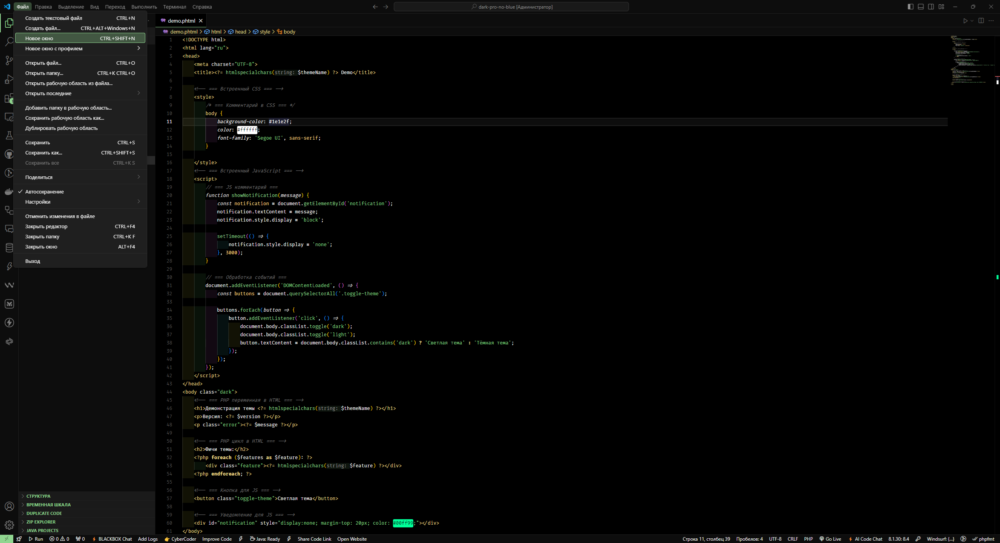
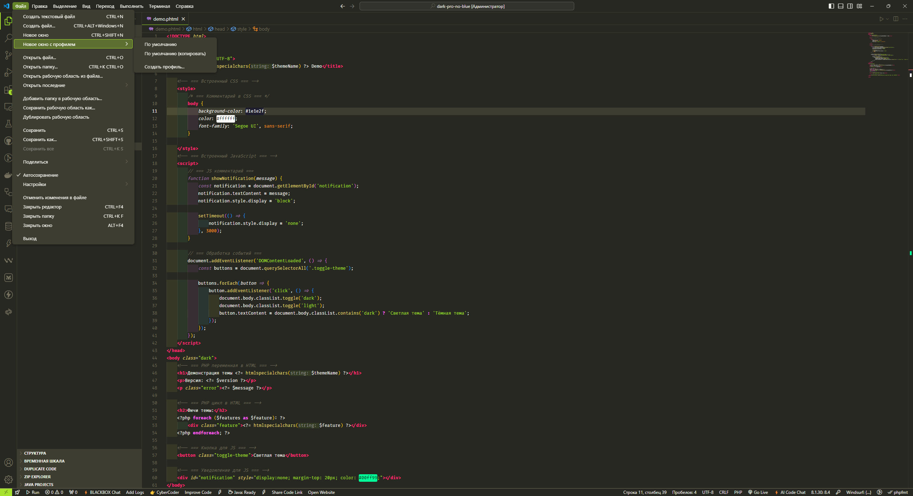
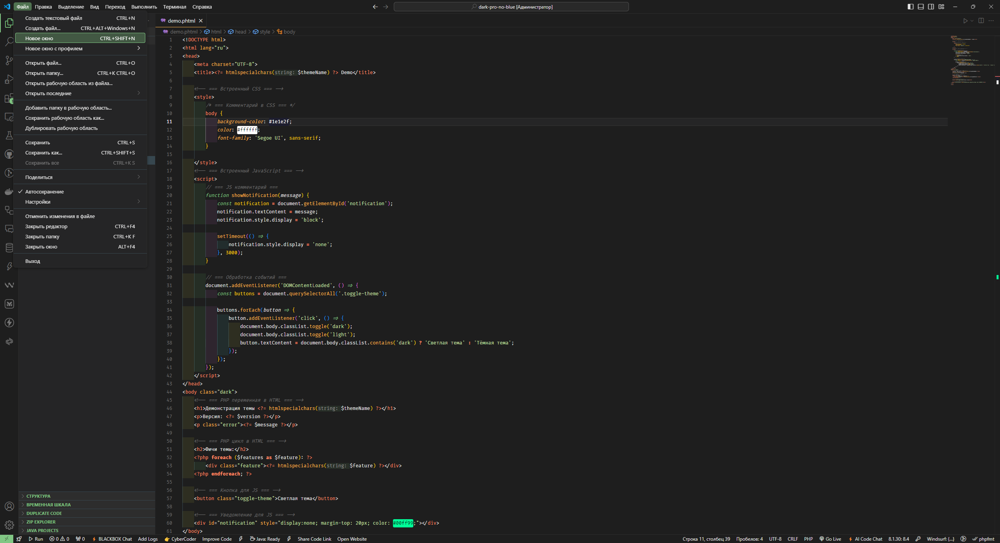
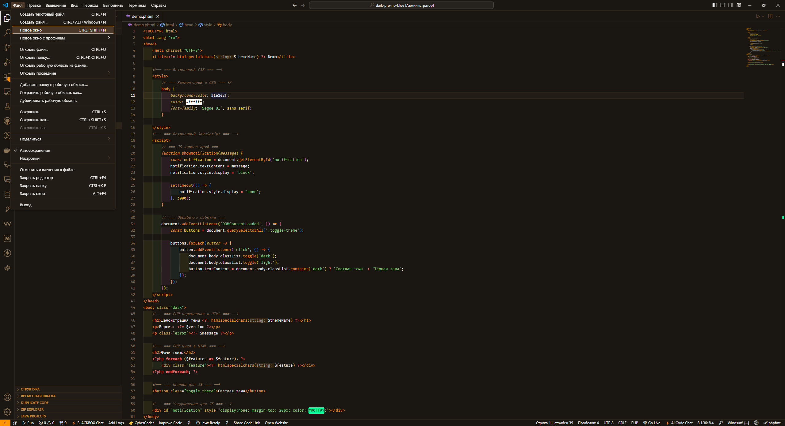

# 🌌 Sirius Theme for VS Code  
> - Тема оформления от **VLMADev** 
> - [EN] Design theme from **VLMADev**

> - Создано с ❤️ для разработчиков 
> - [EN] Created with ❤️ for developers


---

## 📌 Описание (Description)  

- **Sirius Theme** — это современная тема оформления для Visual Studio Code с акцентом на **минимализм, читаемость и стиль**. Поддерживает **тёмный режимы**, идеально подходит для разработчиков, которые ценят аккуратный интерфейс и комфорт при долгом кодировании.

>[EN]
> - **Sirius Theme** is a modern Visual Studio Code theme with an emphasis on **minimalism, readability, and style**. Supports **Dark modes**, ideal for developers who appreciate a neat interface and comfort during long coding.


---

## 🌟 Особенности  (Features)
- **Совместимость**: Поддерживает популярные языки (JavaScript, TypeScript, Python, HTML/CSS, JSON и др.).  
- **Цветовые акценты**: Сбалансированные палитры для синтаксиса, комментариев и ошибок.   

>[EN]
> - **Compatibility**: Supports popular languages (JavaScript, TypeScript, Python, HTML/CSS, JSON, etc.).
> - **Color Accents**: Balanced palettes for syntax, comments, and errors.

---

## 📦 Установка  (Installation)
### Способ 1: Установка через Marketplace  (Method 1: Installation via the Marketplace)
1. Откройте [Visual Studio Marketplace](https://marketplace.visualstudio.com/items?itemName=VLMADev.sirius-theme).  
2. Нажмите **"Install"**.  

>[EN]
> 1. Open the [Visual Studio Marketplace](https://marketplace.visualstudio.com/items?itemName=VLMADev.sirius-theme ).  
> 2. Press **"Install"**.


### Способ 2: Установка .vsix файла  (Method 2: Installation .vsix file)
Если вы скачали `.vsix` файл:
>[EN] If you downloaded the `.vsix` file:


```bash
code --install-extension siriustheme-x.x.x.vsix
```
- x.x.x. заменить на актуальную версию
> [EN] x.x.x. replace with the current version


---
## ⚙️ Настройки (Settings)

### Чтобы изменить тему: (To change the theme:)

1. **Откройте палитру команд (Ctrl + Shift + P).**
2. **Введите:** Preferences: Color Theme.
3. **Выберите:** Sirius - (Astral/Glow/Nebula/Pulsar/Vesper/Vibe/Vortex/Zenith).

>[EN]
> 1. **Open the command palette (Ctrl + Shift + P).**
> 2. **Enter:** Preferences: Color Theme.
> 3. **Choose:** Sirius - (Astral/Glow/Nebula/Pulsar/Vesper/Vibe/Vortex/Zenith).

## Примеры (Examples)

- 
- 
- 
- 
- 
- 
- 

Вы можете найти скриншоты подсветки синтаксиса для определенного языка в папке screenshots, которая находится по следующему пути: screenshots/(название темы)..
>[EN] You can find syntax highlighting screenshots for a specific language in the screenshots folder, which is located at the following path: screenshots/(name of the topic).

Пример настройки в settings.json:
>[EN] An example of a setting in settings.json:
```bash
{
  "workbench.colorTheme": "Sirius - Astral"
}
```
---
## 📖 Лицензия (License)

### MIT


## 📬 Контакт (Contact)
**GitHub:** VLMADev
**LinkedIn:** [vlm](https://www.linkedin.com/in/matveev-vladislav/)
